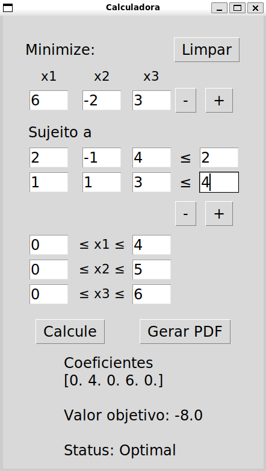

# Calculadora de Simplex 

A construção dessa calculadora foi feita apenas usando `Numpy` para os cálculos do método e `Tkinter` para a construção da interface



Rodar o programa
```
git clone https://github.com/victor-nasc/Simplex-Revisado.git
cd Simplex-Revisado
```

```
pip install numpy tk
python3 main.py
```

## Formulação do Problema

O método **Simplex Revisado** é uma versão otimizada do algoritmo Simplex clássico utilizado para resolver problemas de **programação linear**. Ele manipula apenas as colunas da base em cada iteração, reduzindo o custo computacional.

Um problema de programação linear pode ser representado na forma:

$$
\text{Minimizar: } c^T x
$$

Sujeito a:

$$
A_{eq} x = b_{eq}
$$

$$
l \leq x \leq u
$$

- $c$: Vetor dos coeficientes da função objetivo $(n \times 1)$.
- $A_{eq}$: Matriz de coeficientes das restrições de igualdade $(m \times n)$.
- $b_{eq}$: Vetor do lado direito das restrições $(m \times 1)$.
- $l$ e $u$: Limites inferiores e superiores para $x$ $(n \times 1)$.

---

## Etapas do Método Simplex Revisado

1. **Solução Básica Inicial**  
   Determina-se uma **solução básica viável inicial** adicionando variáveis de folga. Para isso, é incluída uma matriz identidade $I$ às restrições:

$$A_{eq} \gets [A_{eq}, I]$$

   O vetor de custos $c$ é ajustado:

$$c \gets [c, 0, 0, \dots, 0]$$

2. **Definição da Base Inicial**  
   Dividimos as variáveis em dois conjuntos:
   - **Variáveis básicas** ($B$): Inicialmente correspondem às variáveis de folga.
   - **Variáveis não básicas** ($N$): Variáveis originais.

   A matriz $A$ é particionada:

$$A = [B, N]$$

3. **Iteração do Método**  
   Cada iteração realiza os seguintes passos:

   ### a. Solução Básica Atual
   Resolve o sistema linear para encontrar os valores das variáveis básicas ($x_B$):

$$x_B = B^{-1} b_{eq}$$

   ### b. Custos Reduzidos
   Calcula-se os custos reduzidos ($\bar{c}_N$) das variáveis não básicas:

$$\bar{c}_N = c_N - y^T N$$

   Onde:

$$y = c_B^T B^{-1}$$

   - $c_B$: Custos associados às variáveis básicas.
   - $c_N$: Custos associados às variáveis não básicas.

   ### c. Critério de Otimalidade
   Verifica-se se todos os custos reduzidos satisfazem:

$$\bar{c}_N \geq 0$$

   Se a condição for satisfeita, a solução atual é ótima.

   ### d. Determinação da Variável de Entrada
   Caso contrário, seleciona-se a variável não básica com o menor custo reduzido ($\bar{c}_{N_k}$):

$$k = \arg\min(\bar{c}_N)$$

   ### e. Direção da Busca
   Calcula-se o vetor de direção $d$:

$$d = B^{-1} A_k$$

   ### f. Critério de Saída
   Determina-se a variável básica que sairá da base (pivotamento) utilizando o razoável mínimo:

$$\theta = \min ( \frac{x_{B_i}}{d_i} | d_i > 0 )$$

4. **Atualização da Base**  
   A variável de entrada substitui a variável de saída, e o processo é repetido até atingir uma solução ótima ou identificar que o problema é ilimitado.

---
